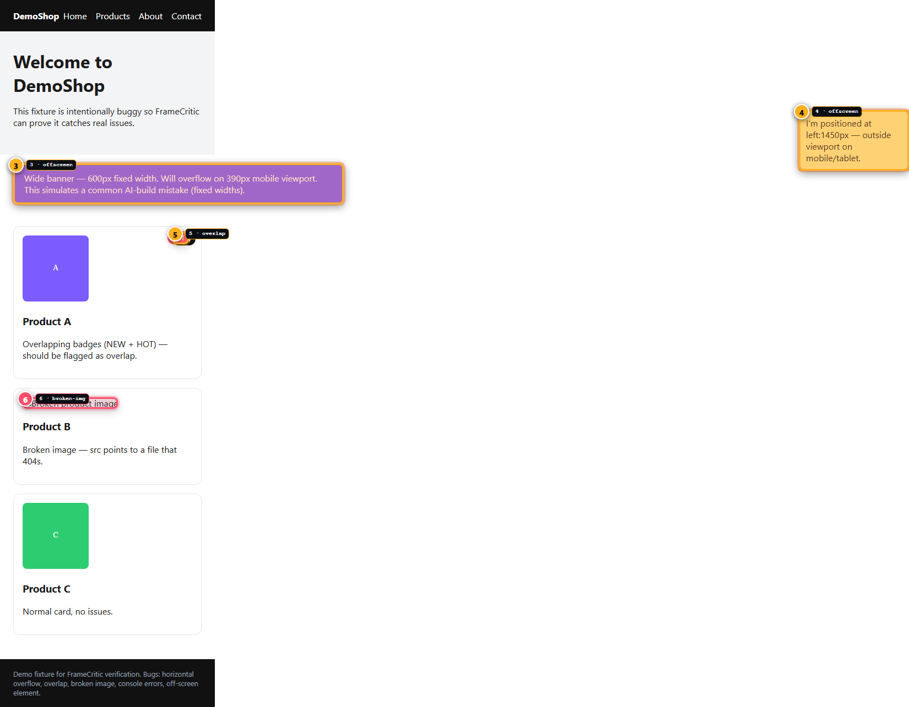

# FrameCritic v0.2 — local visual QA for AI-built web apps

> **Local-first.** No accounts. No cloud. No AI calls.
> Give FrameCritic a `localhost` or public URL — it captures, detects layout and loading issues, and writes evidence you (or an agent) can act on.


*Annotated mobile capture from the intentionally buggy demo — overflow (#1–2), offscreen (#3–4), overlap (#5), broken image (#6). Generated by `node dist/cli.js scan http://localhost:3001 --output framecritic-out/scan-task1-demo` — the annotated PNG is never enough alone; `findings.json` and `AGENT_FIXES.md` carry the structured evidence.*

---

## Problem

AI coding agents now ship whole front-ends in one pass. The result *looks* done until someone resizes the window:

- a 600 px banner that scrolls horizontally on mobile
- a tooltip rendered at `left: 1450px` and clipped on tablet
- two badges stacked with `position: absolute` that visually collide
- an `img` with a 404 and no fallback
- a `console.error` or failed `fetch` that never surfaces in a chat log

Manual resizing and “looks good to me” don’t scale. Teams building with agents need **visual evidence**, not another promise.

## Why FrameCritic exists

FrameCritic is a **visual evidence engine** for the loop:

```
agent builds → FrameCritic scans → evidence (screenshots + JSON + markdown) → agent / human fixes → re-scan
```

- runs **locally** with Playwright (Chromium)
- outputs to `framecritic-out/scan-<timestamp>/` — no upload
- produces both **human** and **agent** artifacts from one run
- checks the reports that matter for AI-built products first (layout, overflow, visibility), not pixel-perfect diffing

If Film Mode ever lands, it will reuse the same capture/detection core. For now, web only.

## Quick start

Prerequisites: Node ≥ 18.

```bash
git clone https://github.com/Abiola-Obafemi/FrameCritic.git
cd FrameCritic
npm install
npx playwright install chromium
npm run build

# One-command scan (three viewports by default)
npx framecritic scan http://localhost:3001
# custom viewports / output / open report
npx framecritic scan http://localhost:3001 --viewport mobile,desktop --output ./my-out --open

# CI gate (deterministic exit codes)
npx framecritic scan http://localhost:3001 --fail-on error --max-warnings 5 --json-summary
#   exit 0 pass, 1 scan/config error, 2 policy failure

# Ignore known intentional issues
# .framecritic.json  -> { "ignore": { "selectors": ["#drawer"], "types": ["overlapping-elements"], "viewports": { "mobile": ["#offscreen"] } } }
npx framecritic scan http://localhost:3001 --config ./my-config.json

# Scenario (declarative, no code execution)
npx framecritic scan http://localhost:3001 --scenario ./fixtures/scenario-menu/scenario.json
# Extended actions: scroll, select, hotkey (modifiers+key) — all validated, no eval
npx framecritic scan http://localhost:3001 --scenario ./fixtures/scenario-select/scenario.json
npx framecritic scan http://localhost:3001 --scenario ./fixtures/scenario-scroll/scenario.json
npx framecritic scan http://localhost:3001 --scenario ./fixtures/scenario-hotkey/scenario.json

# Structural compare (not pixel diff)
npx framecritic compare ./baseline/findings.json ./current/findings.json --fail-on-new

# Optional trace (off by default)
npx framecritic scan http://localhost:3001 --trace
# traces: framecritic-out/scan-*/traces/*.zip  (view with npx playwright show-trace)

# Accessibility diagnostics (opt-in, against TARGET page, NOT WCAG certification)
npx framecritic scan http://localhost:3001 --a11y
# -> findings of type accessibility with rule/impact/nodes/selectors/rects

# Bounded responsive sweep (fixed height 900, max 12 widths)
npx framecritic scan http://localhost:3001 --sweep 320:1200:160
# -> generates sweep-320, sweep-480, ... deterministic labels

# Multi-route batch (max 20, declarative JSON, isolated routes/<name>/)
# routes.json -> { "routes": [{ "name": "home", "path": "/" }, { "name": "broken", "path": "/broken" }] }
npx framecritic scan http://localhost:3001 --routes ./fixtures/multi-route/routes.json
# -> batch.json + index.html linking each route report

# Dashboard
npm start
# → http://localhost:3030  paste a URL, click “Scan”, browse reports at /reports/<scan>/report.html
```

### Demo (intentionally buggy)

```bash
# terminal 1: start the fixture
node demo-app/server.js
# → http://localhost:3001  (wide banner, offscreen element, overlapping badges, broken image, console/page errors)

# terminal 2: scan it
npm run build
node dist/cli.js scan http://localhost:3001 --output framecritic-out/demo
# artifacts:
#   framecritic-out/demo/screenshots/mobile-390x844.png
#   framecritic-out/demo/screenshots/mobile-390x844-annotated.png  (numbered markers)
#   framecritic-out/demo/findings.json
#   framecritic-out/demo/report.html
#   framecritic-out/demo/AGENT_FIXES.md
```

## Screenshots

Captures from `demo-app` (Dark dashboard in `public/index.html`; light, evidence-oriented report in `report.html`):

| Viewport | Clean | Annotated |
|---|---|---|
| **mobile 390×844** | `screenshots/mobile-390x844.png` — full-page, clipped banner and offscreen yellow chip visible at the right edge | `mobile-390x844-annotated.png` — 6 markers: #1–2 overflow, #3–4 offscreen, #5 overlap, #6 broken image |
| **tablet 768×1024** | `tablet-768x1024.png` | `tablet-768x1024-annotated.png` — 4 markers |
| **desktop 1440×900** | `desktop-1440x900.png` | `desktop-1440x900-annotated.png` — 4 markers |

Report highlights:
- **Compact summary:** `18 errors / 12 warnings / 3/3 viewports affected`
- **Filters:** viewport · severity · type (keyboard usable, live region announces `visible / total`)
- **Annotated ↔ Clean toggle** with `role="tablist"` and keyboard arrows/Home/End support

> No screenshots are shipped in the npm package. Run the demo to generate your own under `framecritic-out/`.

## What’s implemented (honest)

- **Scan:** `framecritic scan <url>` at mobile/tablet/desktop (or custom WxH), screenshots + annotated screenshots with numbered markers, `findings.json` + `report.html` + `AGENT_FIXES.md`
- **Config:** `.framecritic.json` with `ignore.selectors / types / viewports` (auto-discovered, `--config` override, validated, no code execution, suppression recorded in `findings.json` and report)
- **CI gate:** `--fail-on error|warning|never` + `--max-warnings N` + `--json-summary` (deterministic exit codes 0/1/2, policy in `findings.json`, terminal and report show policy)
- **Compare:** `framecritic compare <baseline> <current>` classifies NEW/RESOLVED/PERSISTING via stable fingerprints (type+viewport+normalized selectors), produces `comparison.json` + `comparison.html`, optional `--fail-on-new`
- **Scenario:** `--scenario <file>` declarative JSON (click/fill/hover/press/wait/scroll/select/hotkey, validated, no eval), runs per viewport, failure becomes explicit `page-error`, findings tagged with scenario name
- **Trace:** `--trace` captures Playwright trace per viewport to `traces/*.zip` (off by default), reported in terminal/JSON/HTML (`npx playwright show-trace`)
- **Accessibility (opt-in):** `--a11y` runs axe-core against the TARGET page (not the report) and emits structured `accessibility` findings with rule, impact, nodes, selectors and rects where measurable, integrated into `findings.json`/`report.html`/`AGENT_FIXES.md`; labeled as automated diagnostics, NOT WCAG certification
- **Sweep (opt-in):** `--sweep <min>:<max>:<step>` generates bounded sweep viewports (fixed height 900, max 12 widths, labels `sweep-<width>`), reuses detector pipeline, outputs navigable report with per-width findings
- **Multi-route (opt-in):** `framecritic scan <base-url> --routes <routes.json>` bounded batch (max 20 routes, declarative `{routes:[{name,path,scenario?}]}`), resolves relative paths against base safely, isolates per-route artifacts in `routes/<name>/`, produces `batch.json` + `index.html` linking each `report.html`, aggregates counts while preserving route identity, continues on per-route failure
- **GitHub Actions:** `.github/workflows/ci.yml` for FrameCritic itself and `docs/github-actions-example.yml` for consumers
- **Packaging:** `npm pack` verified — contains `dist/`, `public/`, `README`, `LICENSE` (no `src/`, tests, fixtures, secrets, `framecritic-out`)

## Architecture overview

``` 
framecritic/
├── src/
│   ├── cli.ts            — CLI (scan/compare, --output/--viewport/--sweep/--routes/--config/--fail-on/--max-warnings/--json-summary/--scenario/--trace/--a11y)
│   ├── cli-args.ts       — argument parser (exported for tests)
│   ├── config.ts         — .framecritic.json loading + validation + ignore matching
│   ├── policy.ts         — CI gate evaluation (exit codes 0/1/2)
│   ├── compare.ts        — structural fingerprint + NEW/RESOLVED/PERSISTING
│   ├── scenario.ts       — declarative scenario validation + Playwright execution
│   ├── security.ts       — URL redaction, safe paths, header filtering
│   ├── server.ts         — Express dashboard (POST /api/scan, GET /reports)
│   ├── types.ts          — Viewport, Finding, AnnotationBox, ScanReport, Policy, Scenario
│   └── engine/
│       ├── scanner.ts    — Playwright capture @ deviceScaleFactor 1, scenario/trace/a11y, annotation, artifact writer
│       ├── batch.ts      — multi-route orchestration (bounded manifest, per-route isolated dirs, batch.json + index.html)
│       ├── detect.ts     — in-page script (scrollWidth, getBoundingClientRect, overlap, broken images)
│       ├── a11y.ts       — axe-core injection + target-page diagnostics (opt-in --a11y)
│       ├── report.ts     — accessible HTML report with filters/tabs/summary/scenario/trace/policy/a11y
│       └── agentFixes.ts — AGENT_FIXES.md generation per finding
├── public/index.html     — local dashboard (no build step)
├── demo-app/             — intentionally broken fixture (not shipped)
├── fixtures/             — multi-route, a11y-basic, sweep-breakpoint, scenario-* (not shipped)
├── docs/assets/          — real generated demo annotated PNG (committed)
└── framecritic-out/      — per-scan artifacts (ignored in git/npm)
```

**Flow per viewport:**

1. Playwright `newContext({ viewport })` → `page.goto(url, waitUntil: domcontentloaded)` + short `networkidle` settle → collect `console` / `pageerror` / failed `response` listeners
2. `getDetectionScript()` runs in-page (no Node DOM): measures `document.documentElement.scrollWidth`, walks `querySelectorAll('*')`, records `rect` and `cssPath` for offenders
3. Deduplication on `type+message` for console/page errors
4. `buildAnnotationBoxes()` assigns sequential `markerIds` per viewport, stores `AnnotationBox[]`
5. Clean screenshot → inject overlay (`#__fc_overlay`) → annotated screenshot → remove overlay
6. Write `findings.json` (full `ScanReport`), `report.html` (via `generateHtmlReport`), `AGENT_FIXES.md` (via `generateAgentFixesMarkdown`)

## Current detectors

| Detector | Severity | Evidence captured | Marker? | Notes |
|---|---|---|---|---|
| **horizontal-overflow** | error | `scrollWidth vs viewportWidth`, overflow amount, `offenders[]` with `selector`, `width`, `right`, `rect` | ✓ one per offender | Flags when `scrollWidth > viewportWidth + 1`; capped at 12 offenders per viewport |
| **outside-viewport** | warning (error if >5 elements) | `elements[]` with `rect`, `clipped` px, `selector` | ✓ per element | `right > vw+4` or `left < -4` and `clipped > 8`, max 20 |
| **overlapping-elements** | warning (>6 pairs → error) | `pairs[]` with `a`, `b`, `rectA`, `rectB`, `overlap {x,y,w,h,area,ratio}` | ✓ at overlap region (`x,y,w,h`) | Heuristic: `ratio > 0.20` or `area > 2500`, skips ancestor/descendant, candidates capped at 180, sorted text/bg/border heuristic |
| **broken-image** | error | `images[]` with `src`, `alt`, `selector`, `rect` | ✓ per broken image | `!complete || naturalWidth===0` with `src`; includes collapsed `rect` fallback |
| **console-error** | error | `text`, `location {url,line,col}` | ✗ | All `console.type==="error"` |
| **page-error** | error / warning (status `>=500` → error else warning) | `status`, `url` or `stack`/`message` | ✗ | Failed `response.status >=400` (except `favicon.ico` 404), `pageerror` events, `page.goto` timeout |
| **accessibility** (opt-in `--a11y`) | error if `critical`/`serious`, warning otherwise | `rule`, `impact`, `help`, `helpUrl`, `tags`, `nodes[]` with `selector`, `html`, `failureSummary`, `rect`, `affectedSelectors`, `disclaimer` | ✓ per node where meaningful `rect` | axe-core violations run against TARGET page; NOT WCAG certification; capped 12 nodes/violation; selector/rect used for annotation |

Each detector runs independently per viewport; the same page can be clean on desktop and overflow on mobile. The demo triggers all six.

## Limitations (honest)

- **Heuristics, not proof:** Overflow and overlap are geometry-based and can mis-fire on intentional designs (offscreen drawers, decorative overlaps). Use `.framecritic.json` to suppress known intentional cases and always confirm selector in source. Dogfooding the dashboard showed 15-pair overlap false positives inside scrollable findings containers — left as heuristic limitation, not detector weakening.
- **Viewports:** Three presets plus custom `WxH`, plus optional bounded sweep `--sweep <min>:<max>:<step>` (fixed height 900, max 12 widths, not every responsive state; document as not exhaustive).
- **Chromium only:** Playwright `chromium` required.
- **Scenario coverage:** Safe declarative set (click/fill/hover/press/wait/scroll/select/hotkey, max 20 steps, wait ≤5000ms, scroll 0..10000, select value ≤1000, hotkey strict modifiers+key); no `eval`, no arbitrary JS.
- **Trace:** Optional `--trace` only; large traces may affect disk/time.
- **Accessibility (target):** Optional `--a11y` runs an automated axe-core scan against the TARGET page (not the report). Findings are deterministic diagnostics, NOT WCAG compliance certification; manual review is required. Report itself remains semantic/keyboard/focus/contrast compliant.
- **No pixel diff:** Structural findings only; `compare` is fingerprint-based, not visual diff.
- **Security:** Best-effort redaction (credentials, query tokens) and safe paths; not a full audit. See `src/security.ts`.
- **Local artifacts:** `framecritic-out/` is local and untracked.

## Roadmap

Planned, not promised:

- [ ] More detectors: missing `alt`, empty interactive labels, large layout shift candidates, truncated text, z-order traps
- [x] axe-core pass for the *target* page (`--a11y` opt-in, automated diagnostics, NOT WCAG certification) — shipped in v0.2 milestone 1
- [x] Bounded responsive width sweep (`--sweep <min>:<max>:<step>`, fixed height 900, max 12 widths) — shipped in v0.2 milestone 2
- [x] Expanded scenario actions (scroll with bounded coordinates/selector, select for &lt;select&gt;, hotkey with strict modifiers+key validation) — shipped in v0.2 milestone 3
- [x] Multi-route batch scan (`--routes <routes.json>`, max 20, declarative, per-route isolated artifacts, batch.json + index.html) — shipped in v0.2 milestone 4
- [ ] HTML validation for the *target* page
- [ ] Expanded scenario actions (scroll, select, keyboard combos)

Out of scope: accounts, billing, cloud storage, AI inference, proxying, multi-tenant hosting.

## AI-use disclosure

- **Runtime:** FrameCritic does **not** call any AI API at scan time. All detectors are deterministic Playwright + DOM math.
- **Build-time assistance:** The codebase was drafted with an AI coding assistant under human direction (including detectors, report accessibility, CLI ergonomics, and `AGENT_FIXES.md` templates). Every finding rendered in the report is measured, not generated.
- **Agent fix suggestions:** `AGENT_FIXES.md` offers *“suggested investigation”* prompts per finding (e.g., “Check fixed width on `body > div.wide-banner`”). They deliberately avoid claiming a definitive fix when evidence is insufficient. The selector and `rect` are evidence; the prose is a nudge to look in the right file.

---

## CLI error handling (actual behavior)

All CLI errors are **concise, deterministic, non-secret-leaking, and exit nonzero**. Validated by `src/cli-error-handling.test.ts` (60 tests).

| Input | Behavior | Exit |
|---|---|---|
| **Malformed sweep** `bad`, `320:800`, `a:b:c`, `100:800:100`, `800:320:100` | `Error: --sweep requires format <min>:<max>:<step>` or bounds/step errors | 2 |
| **Too many widths** `200:1400:100` → 13 widths | `Error: --sweep would generate 13 widths — hard cap is 12` | 2 |
| **Viewport + sweep conflict** `--viewport mobile --sweep 320:800:100` | `Error: Cannot combine --sweep and --viewport` | 2 |
| **Missing routes file** `--routes nope.json` | `Routes manifest not found: <abs>` | 1 (scan error) or per-route `status:error` in batch |
| **Invalid route JSON** malformed JSON, empty, duplicate names, unsafe name, `ftp://` | `Invalid JSON in routes manifest …` or `Invalid routes manifest …` | 1 or per-route error |
| **Missing scenario** `--scenario nope.json` / per-route `scenario` missing | `Scenario file not found: <abs>` | 1 (single) / per-route `error` (batch continues) |
| **Malformed scenario** unknown `action: eval`, missing `selector`, extra keys, `steps:[]`, `wait ms >5000`, `scroll` without `selector/x/y`, `hotkey Bad+Enter` | `Invalid scenario …: steps[i].action must be one of …` | 1 |
| **a11y runtime failure** axe load error | Warning finding `accessibility` with `disclaimer`, pipeline continues | 0 (scan succeeds, no crash) |
| **Output collision** `--output <file>` where file exists | `Output directory collision: "<path>" exists and is not a directory` | 1 |
| **Existing output dir** `--output <dir>` where dir exists | Reused deterministically; artifacts overwritten (`findings.json` mtime updated) | 0 |
| **Unsupported combo** `--routes x --scenario y` | `Cannot combine --routes and --scenario` | 2 |
| **Unknown option** `--unknown` | `Unknown option "--unknown". See --help.` | 2 |
| **Invalid --fail-on / --max-warnings / --config** | `must be one of: error, warning, never` / `must be a non-negative integer` / `Config file not found` | 2 or 1 |
| **Invalid URL with credentials** `ftp://user:pass@…?token=abc` | `Invalid URL "http://***:***@…?token=***": unsupported protocol` — **redacted** | 1 |
| **Compare missing args** `compare a.json` | `compare requires two arguments` | 2 |
| **Compare invalid JSON / missing file** | `Invalid JSON in <path>` / `ENOENT` | 1 |

Notes:
- Secrets (`user:pass`, `token`, `key`, `secret`, `api_key`, `access_token`, `auth`) are redacted via `redactUrl()` before any error or artifact write (`src/security.ts`, `scanner.ts:normalizeUrl`, `routes.ts:resolveRouteUrl`, `batch.ts`). Verified: raw values never appear in stderr or `findings.json`.
- Messages are deterministic: same input → same message (no timestamps/random). Checked via dual-call equality.
- Concise: all messages <500 chars prefix; no stack dumps unless `page-error` finding details.
- Batch routes isolate failures: one route's missing scenario/a11y error → `status:error` for that route, `batch.json` + `index.html` still written, other routes still scanned.

## Development

```bash
npm run build   # tsc → dist/
npm test        # node --test dist/**/*.test.js  (281 tests: CLI, config, policy, compare, scenario, sweep, trace, detectors, annotations, report, a11y, batch, artifact, windows-compat, cli-error-handling, security-bounds, regression-dogfood, report-accessibility)
npm pack --dry-run  # verify tarball: ~68 files, ~86 kB package, ~371 kB unpacked — no src/tests/demo-app/fixtures/framecritic-out/.env
node scripts/package-smoke.js  # static packaging checks
```

**Windows (PowerShell) notes:**
- Use PowerShell 5.1 or later (this is a Windows PowerShell audit). All `npm` invocations use `npm.cmd` automatically; do not call `npm` directly via bash.
- `npm test` uses double-quoted glob `node --test "dist/**/*.test.js"` so PowerShell does not suppress tests (single quotes break on Windows). Verified on Windows with 281 tests.
- Paths with spaces (e.g. `C:\Users\Abiola Obafemi\...`) are fully supported: `--output`, `--config`, `--scenario`, `--routes`, and `os.tmpdir()` all use `path.join`/`path.resolve` and are covered by `windows-compat.test.ts`.
- `framecritic scan --open` on Windows uses `cmd /c start "" "<path>"` via `spawn` (auto-quoted), falling back to `file:///C:/...%20...` encoded URL; no `xdg-open`/`open` assumption.
- `npx playwright install chromium` (without `--with-deps`) is the Windows equivalent; `--with-deps` is Ubuntu-only.
- `tar -tzf framecritic-*.tgz | sort` works on Windows 10+ (bundled `tar.exe`); PowerShell alternative: `tar -tzf framecritic-*.tgz | Sort-Object`.
- For the dashboard `docs/github-actions-example.yml`, `npm start &` is bash background on Ubuntu. On Windows PowerShell use a separate terminal or `Start-Process -NoNewWindow npm -ArgumentList 'start'`.

**Project conventions:** `public/` hand-written, `dist/` build output, `framecritic-out/` ignored, `NIGHT_SHIFT.md` historical backlog not shipped. Versioning pre-1.0 (`0.2.0`) — breaking changes without major bump until `1.0.0`.

**No fake claims:** No paying customers, users, revenue, accuracy %, or production adoption claimed. Every screenshot is generated by a real scan (see `docs/assets/framecritic-demo-mobile-annotated.png` from `framecritic-out/scan-task1-demo`).

License: MIT © 2026 Abiola Obafemi
